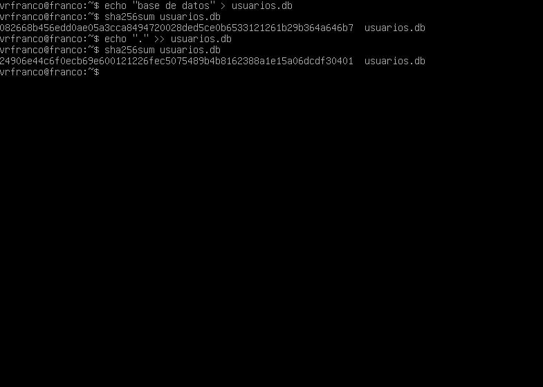
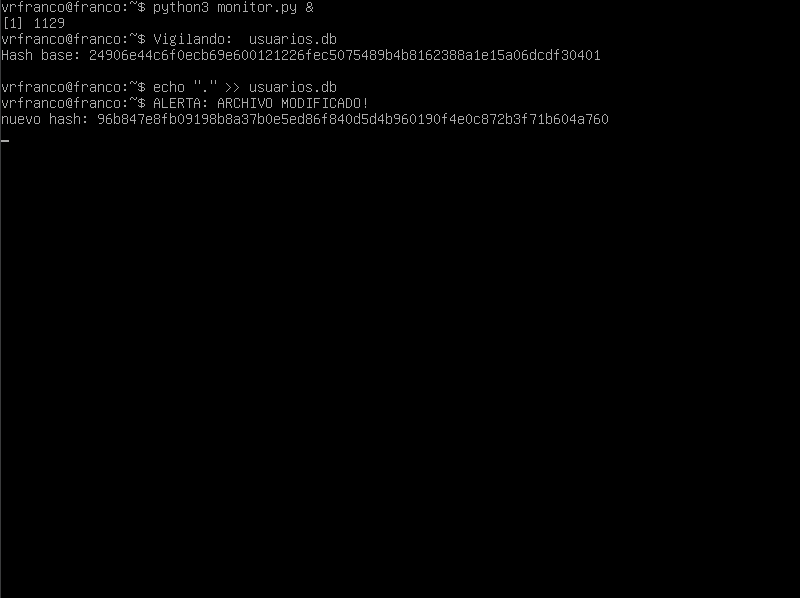

# lab-data-integrity-hashing
#  Integridad de Datos: Hashing y Automatización (FIM)

###  Resumen del Proyecto
Este laboratorio explora el principio de **Integridad** de la tríada CIA. El objetivo fue demostrar cómo detectar modificaciones no autorizadas en archivos críticos.
El proyecto se divide en dos fases:
1.  **Prueba de Concepto (PoC):** Verificación manual con comandos de Linux.
2.  **Automatización:** Desarrollo de un script en Python (File Integrity Monitor) para detección en tiempo real.

---

###  Stack Tecnológico
* **OS:** Linux (Ubuntu Server).
* **Lenguajes:** Bash, Python 3.
* **Criptografía:** SHA-256.

---

###  Fase 1: Verificación Manual (CLI)
Primero, utilicé la terminal para entender el "Efecto Avalancha". Creé un archivo, calculé su hash, lo modifiqué levemente y verifiqué cómo la firma digital cambiaba radicalmente.

#### Evidencia Manual
> *Aquí se observa el cambio de hash tras agregar un solo caracter.*


---

###  Fase 2: Automatización con Python
Tras entender el concepto manual, decidí **automatizar la defensa**. Desarrollé un script simple de *File Integrity Monitoring (FIM)* en Python.

**El Script (`monitor.py`):**
* Calcula el hash SHA-256 inicial del archivo objetivo.
* Entra en un bucle infinito monitoreando el archivo cada 1 segundo.
* Si detecta que el hash cambia, lanza una **ALERTA** inmediata en la consola.

#### Código del Script
```python
import hashlib, time, os

archivo = "usuarios.db"

# Funcion simple para obtener el hash SHA-256
def obtener_hash():
    with open(archivo, "rb") as f:
        return hashlib.sha256(f.read()).hexdigest()

# Crear archivo si no existe para la prueba
if not os.path.exists(archivo):
    with open(archivo, "w") as f:
        f.write("secreto")

# Guardamos el estado inicial (Integridad OK)
base = obtener_hash()
print(f"Vigilando: {archivo}")
print(f"Hash Base: {base}")

# Bucle de monitoreo
while True:
    time.sleep(1)
    # Si el hash actual es distinto al base -> ALERTA
    if obtener_hash() != base:
        print("ALERTA: ARCHIVO MODIFICADO!")
        print(f"Nuevo Hash: {obtener_hash()}")
        break
